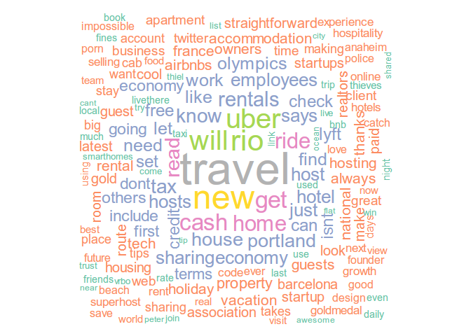
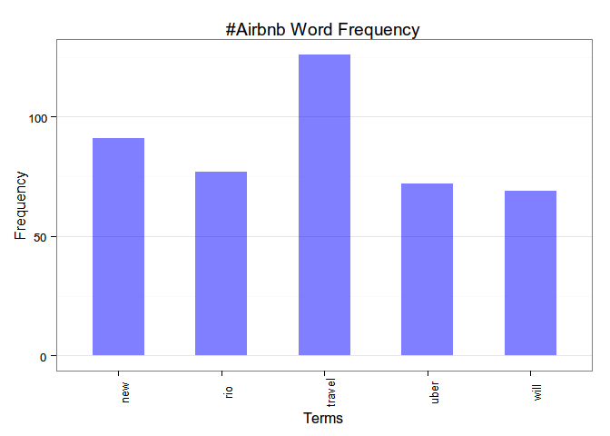
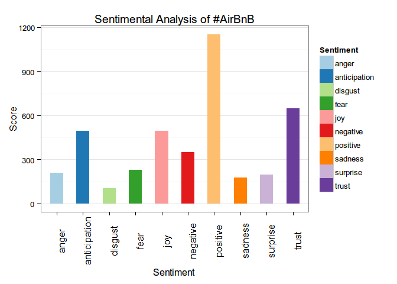

A Look at Airbnb's Twitter
================

There's been a lot of talk surrounding Airbnb lately, so I've decided to make a word cloud and perform some sentiment analysis on tweets with the hashtag, **\#Airbnb**. (I am not affiliated with Airbnb)

``` r
library(twitteR)
library(RCurl)
library(SnowballC)
library(tm)
library(wordcloud)
library(RColorBrewer)
library(ggplot2)
library(syuzhet)
```

Setting up Twitter
------------------

We'll need to setup an account to access [Twitter's API](https://apps.twitter.com). For this analysis, we need the consumer key, consumer secret ID, access token, and the access token secret. It'll be helpful to save the keys and IDs to a variable.

Let Twitter authenticate the account to use its API.

``` r
setup_twitter_oauth(consumer_key,consumer_secret,access_token,access_secret)
```

    ## [1] "Using direct authentication"

Once we run that line of code, it'll give a message: "Use a local file to cache OAuth access credentials between R sessions?" You can select **1** for "yes" or **2** for "no" on whether you would like to set up a local file to cache your credentials for next time you use the "app" in R. In my case, I am using a local file.

Searching and Cleaning
----------------------

After that setup, we can now start using Twitter to search for our hashtag with the `searchTwitter` function. Super easy.

``` r
air_tweets <- searchTwitter("#Airbnb", resultType = "recent", n=1500, lang="en")
```

Twitter will return the 1500 most recent tweets in a large list. In order to do any type of analysis, data cleaning is required and this is no exception. Since our interest is in the tweets, we have to extract the text and clean out things such as emojis, punctuations, and numbers.

``` r
air_text <- sapply(air_tweets, function(x) x$getText()) #extract the text from the list with tm package's function
air_text <- sapply(air_text, function(z) iconv(z, "latin1", "ASCII", sub="")) #changes the encoding
air_text <- gsub("(f|ht)tp(s?)://(.*)[.][a-z]+", "", air_text) #finds most http links and removes them
air_text <- gsub("(RT|via)((?:\\b\\W*@\\w+)+)", "", air_text) #removes retweets
air_text <- gsub("[[:digit:]]", "", air_text) #removes numbers
air_text <- gsub("[[:punct:]]", "", air_text) #removes punctuations
```

We could've used the **tm** library's numerous cleaning functions, but that works only on a corpus (which we'll be creating next). We cleaned prior to creating the corpus because the text will be used for our sentiment analysis.

Wordcloud
---------

Now that that's cleaned up we can begin creating the wordcloud.

``` r
air_corpus <- Corpus(VectorSource(air_text))

air_clean <- tm_map(air_corpus, function(x) gsub("http[[:alnum:]]*", "", x))
air_clean <- tm_map(air_clean, tolower)
air_clean <- tm_map(air_clean, PlainTextDocument)
air_clean <- tm_map(air_clean, removeWords, c(stopwords("english"), "airbnb", "amp"))
air_clean <- tm_map(air_clean, stripWhitespace)
```

The first line creates a corpus needed for the **tm** package to transform and clean the text. In the code block, it'll make everything lowercase, and then into a text format so that the wordcloud can process it. The code after `PlainTextDocument` is just added for additional removal of any possibly missed urls. We'll omit the word "airbnb" because it's already expected to be the most used word in the hashtag. We'll also remove stopwords such as "the," "a," and "in." Since there'll be a lot of empty space, we'll just remove them.

``` r
wordcloud(air_clean, min.freq=10, random.order = F, colors=brewer.pal(8, "Set2"))
```



Mostly positive and neutral words are seen in the wordcloud. Not too surprisingly, one of the most common words is "travel." The majority of the words have some relation to the subject matter relating "property" or "economy." Also, since it's August 2016 (as of this writing), some words have connection to the Olympics like Rio.

Let's check the emotions and sentiments revolving around Airbnb.

Word importance and analysis
----------------------------

### Looking at word frequency

I think it'll be interesting to analyze the word frequency of **\#Airbnb**. It'll also give a more quantitative perspective compared to viewing only a word cloud.

``` r
air_dtm <- DocumentTermMatrix(air_clean)
```

In this analysis, we'll be using a document term matrix (DTM) instead of a term document matrix (TDM). It really doesn't matter which one uses, but the decision forces the use either `colSums` or `rowSums`. Since we're using a DTM, we need to use `colSums`. The reason is because of the matrix's structure and how it impacts the addition of the sentiment. We don't want any false calculations! A DTM will look like this:

|      |     | term1 |     | term2 |     | term3 |
|------|-----|-------|-----|-------|-----|-------|
| Doc1 |     | 1     |     | 5     |     | 0     |
| Doc2 |     | 0     |     | 1     |     | 0     |
| Doc3 |     | 1     |     | 0     |     | 1     |

We want to add the total number of instances a word has been used vertically.

``` r
airsum <- colSums(as.matrix(air_dtm))
freq <- order(airsum, decreasing = TRUE)
airsum[head(freq, 20)]
```

    ##    travel       new       rio      uber      will       get      cash 
    ##       126        91        77        72        69        59        56 
    ##      home      ride      read   rentals      know       tax     house 
    ##        52        51        48        47        44        44        43 
    ##  portland employees     hosts      just      host     hotel 
    ##        43        41        41        41        40        40

The output is the 20 most frequent words used. As seen in the wordcloud, "travel" is the most common word used. Interestingly, "uber" is also one of the most frequent words. Most likely, guests who use Airbnb service want an easy means of transportation when abroad. Also, it seems possible that a lot of guests are looking to travel to Rio and are deciding to live with a host in Brazil. Let's create a barplot for the frequent terms.

``` r
df <- data.frame(Terms = names(airsum), Frequency = airsum)

bar = ggplot(subset(df, airsum>60), aes(Terms, Frequency))+
     geom_bar(width =0.5, stat='identity', fill="blue", alpha=0.5)+
     labs(title='#Airbnb Word Frequency')+
     theme_bw() +
     theme(axis.text.x = element_text(angle=90, vjust=1, size = 10),
           panel.grid.minor.x=element_blank(),
           panel.grid.major.x=element_blank())
bar
```



What about the least frequent terms?

``` r
airsum[tail(freq, 5)]
```

    ## zvqxbiwpt     zvttg  zvwcyhkm  zwdonltq zwvbpzrsy 
    ##         1         1         1         1         1

As seen, it's just leftover gibberish from when the data was cleaned. It is also possibly from the library's limitations in transforming and cleaning the data.

Since, "uber" popped up as one of the most frequent terms in the hashtag. Let's find how associated it is with other words in the tweets.

``` r
findAssocs(air_dtm, "uber", 0.2) #find words with a minimum correlation of 0.2
```

    ## $uber
    ##           taxi           free        alibaba           lyft      alongside 
    ##           0.42           0.32           0.30           0.27           0.26 
    ##       analysis            car  collaborative            csa         deemly 
    ##           0.26           0.26           0.26           0.26           0.26 
    ##       examples          forum       snappcar          suzys        svuyvgw 
    ##           0.26           0.26           0.26           0.26           0.26 
    ##           swot           zios            cab           ride        advisor 
    ##           0.26           0.26           0.25           0.24           0.23 
    ##         cphftw     dmsdpcwmdi        drivers        fintech          flags 
    ##           0.23           0.23           0.23           0.23           0.23 
    ##          garde          hoods       iibfpqup    inspiration           kids 
    ##           0.23           0.23           0.23           0.23           0.23 
    ##        netflix        playing        seniors      sleepover      wnifahmuy 
    ##           0.23           0.23           0.23           0.23           0.23 
    ##         credit        created          joins            old sharingeconomy 
    ##           0.22           0.21           0.21           0.21           0.21 
    ##       platform 
    ##           0.20

Seems that the term "uber" is associated with famous companies and organizations. Since this is regarding the tweets of Airbnb, one can say that Airbnb has a big reputation or influence alongside these businesses.

### Sentiment Analysis

To conclude our look at **\#Airbnb**, we'll use a bar plot to visualize the sentiments surrounding tweets about it.

``` r
st <- get_nrc_sentiment(air_text)

stsum <- colSums(as.matrix(st))

# Put in dataframe and plot it
p <- data.frame(Sentiment = names(stsum), Score=stsum)
pbnb <- ggplot(p, aes(Sentiment, Score, fill=Sentiment))+
     scale_fill_brewer(palette="Paired")+
     geom_bar(width=0.5, stat='identity')+
     labs(title='Sentimental Analysis of #AirBnB')+
     theme_bw()+
     theme(axis.text.x = element_text(angle=90, vjust=1, size = 12),
           panel.grid.minor.x=element_blank(),
           panel.grid.major.x=element_blank())
pbnb
```



The `get_nrc_sentiment` function categorizes each tweet's words with a feeling. It is good to be skeptical about the results because despite the function's usefulness, human language is very complex. For example, instances of sarcasm may not be captured well with the library's algorithm.

Overall, the plot shows a strong sentiment from the tweets with \#Airbnb. In fact, the *positive* and the *trust* score is highest among the other emotions. It seems a majority of people (as of August 12, 2016) have a nice experience with Airbnb services.

Closing Thoughts
----------------

From analyzing tweets with the hashtag **\#Airbnb**, it seems people have an overall positive impression of Airbnb.
